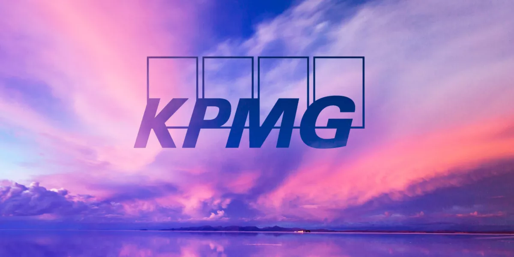

# Ai Happens Here!!!
Welcome to the KPMG AuditChat documentation. This index outlines the foundational concepts and knowledge required to effectively utilize the AuditChat platform. Our AI-centric audit productivity platform is designed to enhance your auditing processes through advanced technology. Before diving into the specifics of AuditChat, it's essential to understand the underlying principles that drive its functionality and how they can be leveraged to optimize your auditing workflow.


This documentation is designed to provide you with a deep understanding of AuditChat and its capabilities, ensuring you can fully leverage the platform to enhance your audit processes. Whether you are new to AuditChat or looking to explore its more advanced features, this guide will support you every step of the way.

## Examples of documentation features
This is a `code` insert.

Below is a code block:
```python
some
code
block
here
```